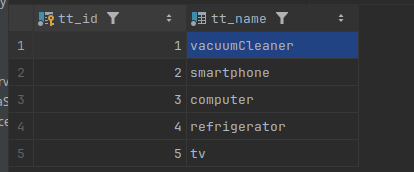

### Добавление новый позиций и моделей к ним, в зависимости от выбранного вида техники.

1. Вибираем вид техники. Возьмем к примеру пылесос (id = 1)
   

   Или другой вид техники, получить id можно через эндпоинт **api_v1/technics_types/get_all_technics_types**

        POST http://localhost:8091/api_v1/technics_types/get_all_technics_types
        Content-Type: application/json

        {
         "pageNumber": 0,
         "pageSize": 10,
         "sortBy": "id",
         "order": "ASC"
        }

   Или создаем новый вид техники. **api_v1/technics_types/add**

        POST http://localhost:8091/api_v1/technics_types/add
        Content-Type: application/json

        {
         "name": ""
        }
   Будем считать что хотим добавить модель пылесоса id = 1.

2. Начать можно и сразу с этоготпункта:
   Или берем экземпляр по id типа техники c предыдущего шага или получаем список всех technics_type_data
   Нужно определится с экземпляром вида - technics_types_data
   создаем свой или выбираем из существующих **/api_v1/technics_type_data/get_paged**

       
      POST http://localhost:8091/api_v1/technics_type_data/get_paged
      Content-Type: application/json

      {
       "technicsTypeId: 1"
       "pageNumber": 0,
       "pageSize": 10,
       "sortBy": "id",
       "order": "ASC"
      }

   Будем считать что выбрали этот  ID = 8
     
      {
       "id": 8,
       "technicsTypeId: 1"
       "manufactureCountry": "KOR",
       "manufacturerName": "Samsung",
       "installmentsAvailable": true,
       "onlineOrderAvailable": true
      }

3. добаляем модель 
            
            Свойства: 
            "optionValueDtos": []
            "colorId": 0,
            "modelSizeId": 0
            для простоты в запрос не включаем

         POST http://localhost:8091/api_v1/technics_models/add
         Content-Type: application/json

         {
          "name": "MEGA PYLESOS 3000",
          "serialNumber": "MGPLSL3K_3000",
          "price": 1000000,
          "technicsTypeDataId": 1
         }
         
         RESPONSE: Response code: 201

         {
         "id": 32,
         "name": "MEGA PYLESOS 3000",
         "color": null,
         "serialNumber": "MGPLSL3K_3000",
         "modelSize": null,
         "price": 1000000,
         "inStock": false,
         "modelOptionsValues": []
         }
при создании можно указывать  modelOptionsValues - допсвойтсва специфичные для вида техники. Но их предварительно нужно создать.