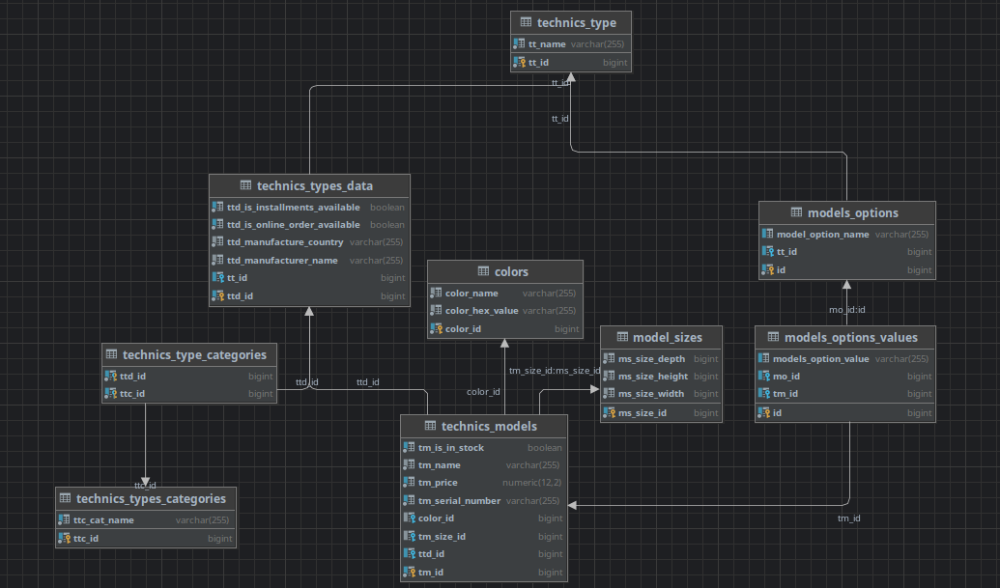

### Структура БД
1. Корневой сущностью выбран Вид техники(`technics_type`)
2. Атрибуты вида техники кроме собственно названия вынесены в отдельную таблицу (`technics_type_data`).
   (Пример. Холодильник - это вид техники. Холодильник с определенным производителем, условиями продажи итд - это `technics_type_data`)
3. Вынеся вид в отдельную таблицу получилось сделать атрибуты, специфичные только для вида, сделать зависимыми только от вида. 
   `models_options` - определения атрибутов, `models_options_values` - значения атрибутов
4. Для `technics_type_data` можно определить категории (сначала создав их) связав многие ко многим.
   Категорию решено привязать на уровне определения вида техники потому что категория к примеру 'десктоп' или 'ноутбук' 
  относится скорее к виду техники, чем к моделям. Для моделей же я определил динамические свойства.
5. `technics_models` - МоделиТехинки - центральная талица в бд и сущность в системе. В ней определены все свойства моделей которые повторялись от одной модели техники к другой(кроме категории).
    Цвета `colors` и Размеры `models_sizes` вынесены в отдельные таблицы со связью 1 к 1.
6. И наконец, `technics_models` связана один ко многим со значениями опций`models_options_values` - таким образом получаем возможность динамически добавлять для любого типа техники
 новые свойства и определять их значения для моделей.
   